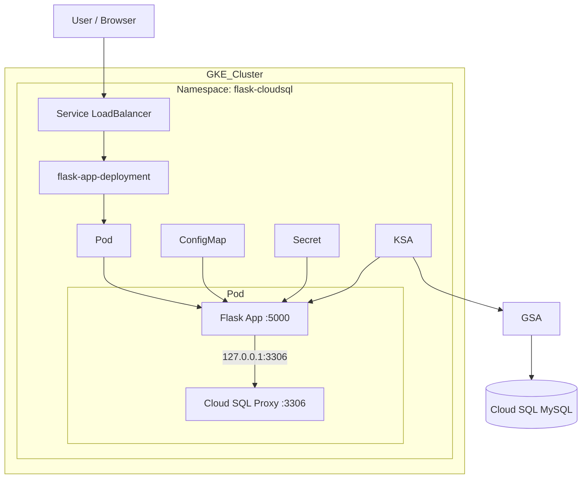

# Python Application on GKE with Cloud SQL 

## Project Overview

This project demonstrates a two-tier application where a Python (Flask) backend is deployed on Google Kubernetes Engine (GKE) and securely connects to a managed MySQL database hosted on Cloud SQL.

It follows modern cloud-native best practices such as:

* Workload Identity (no static credentials)
* ConfigMaps and Secrets for configuration
* Sidecar pattern using Cloud SQL Auth Proxy
* Kubernetes LoadBalancer for external access

---

## Architecture


---

## Tech Stack

- Kubernetes (GKE)
- Docker
- Python
- Google Cloud Shell 
- Cloud SQL(MySQL)
- Google Artiact Registry
- IAM & Workload Identity

---

## Setup & Deployment

### Prerequisites

- GCP account
- Enabled APIs:
  - Kubernetes Engine API
  - Artifact Registry API
- IAM Roles
  - roles/container.admin → create/manage GKE
  - roles/storage.admin → create bucket/push Docker image
  - roles/cloudsql.admin → create Cloud SQL
  - roles/iam.serviceAccountAdmin → create service accounts
  - roles/iam.serviceAccountUser → bind identitiy
  - roles/artifactregistry.admin → create/manage AR repo 
- Authenticate Cloud Shell


---

### Step 1: Create Cloud SQL (MySQL)

📌 Update the values in the manifests accordingy 

1. Go to Cloud SQL in GCP Console

2. Click **Create Instance → MySQL**

3. Provide instance ID, password and create the instance with necessary configuration

4. Go to **Databases** once the instance is up and running

5. Create a Database as mydb

6. Click on Query Editor, create a DB_USER and DB_PASSWORD

7. Login to "mydb" using the user ID and password

8. Run the queries:

```sql

USE mydb;

CREATE TABLE messages (
  id INT AUTO_INCREMENT PRIMARY KEY,
  content VARCHAR(255)
);

INSERT INTO messages (content)
VALUES ('Hello from Cloud SQL!');
```

Note the instance connection name as it will be used in cloud sql proxy later:

```
PROJECT_ID:REGION:INSTANCE_NAME
```

---

## Step 2: Create & connect to GKE Cluster

```bash
# Create
gcloud container clusters create cluster-1 \
  --region us-central1 \
  --workload-pool=YOUR_PROJECT_ID.svc.id.goog

#Connect 
gcloud container clusters get-credentials cluster-1 --region us-central1
```

---

## Step 3: Create namespace

```bash
# Clone the git repo in cloud shell
git clone https://github.com/SreyasiB/gke-cloudsql.git

# Create namespace
cd k8s-manifests/
kubectl apply -f namespace.yml
```

##  Step 3: Configure Workload Identity

#### Create Google Service Account (GSA)

```bash
gcloud iam service-accounts create cloudsql-gsa
```

#### Grant permissions

```bash
gcloud projects add-iam-policy-binding YOUR_PROJECT_ID \
  --member="serviceAccount:cloudsql-gsa@YOUR_PROJECT_ID.iam.gserviceaccount.com" \
  --role="roles/cloudsql.client"
```

#### Create Kubernetes Service Account

```bash
kubectl create serviceaccount ksa-flask-app --namespace flask-cloudsql
```

#### Bind Kubernetes SA to GSA

```bash
gcloud iam service-accounts add-iam-policy-binding \
  cloudsql-gsa@YOUR_PROJECT_ID.iam.gserviceaccount.com \
  --role roles/iam.workloadIdentityUser \
  --member "serviceAccount:YOUR_PROJECT_ID.svc.id.goog[flask-cloudsql/ksa-flask-app]"
```

#### Annotate KSA 

```bash
kubectl annotate serviceaccount \
--namespace flask-cloudsql ksa-flask-app \
 iam.gke.io/gcp-service-account=cloudsql-gsa@PROJECT_ID.iam.gserviceaccount.com
```

---

## Step 4: Build & Push Docker Image to Google Artifact Registry

#### Create a repo in Artifact Registry

```bash
gcloud artifacts repositories create demo-repo \
    --repository-format=docker \
    --location=us-central1 
```

#### Build the image locally in cloud shell

```bash
cd app/
docker build -t flask-app .
```
#### Configure Docker Authentication

📌 Replacing region with the repository's region

```bash
gcloud auth configure-docker us-central1-docker.pkg.dev
```

#### Tag and Push the Image to the repo

```bash
# Tag the image
docker tag flask-app us-central1-docker.pkg.dev/[PROJECT-ID]/demo-repo/flask-app:v1

# Push the image
docker push us-central1-docker.pkg.dev/[PROJECT-ID]/demo-repo/flask-app:v1
```

---

## Step 5: Kubernetes Deployment

#### Apply all manifests:

```bash
kubectl apply -f k8s-manifests/
```

---

## Step 6: Verify Deployment

```bash
kubectl get pods -n flask-cloudsql
kubectl get svc -n flask-cloudsql
```

Wait for EXTERNAL-IP to be assigned.

---

## Step 7: Access Application

#### Open in browser:

```
http://EXTERNAL-IP
```

#### Expected output:

```json
{
  "status": "success",
  "message": "Hello from Cloud SQL!"
}
```

---

## Key Concepts

* Workload Identity for secure authentication
* Cloud SQL Auth Proxy sidecar pattern
* ConfigMaps vs Secrets
* Kubernetes Deployment & Service

---

## Challenges faced

* Incorrect instance connection name due to which pods were failing with Exit Code 1


## Troubleshooting steps

#### Checked pod logs

```bash
kubectl logs <pod-name> -n flask-cloudsql -c cloudsql-proxy # -c is to check specific container logs
```

#### Inspected the Pod status

```bash
kubectl describe pod <pod-name> -n flask-cloudsql
```

#### Validated YAML manifest

Double-check your YAML manifest for typos in image names or environment variables 


