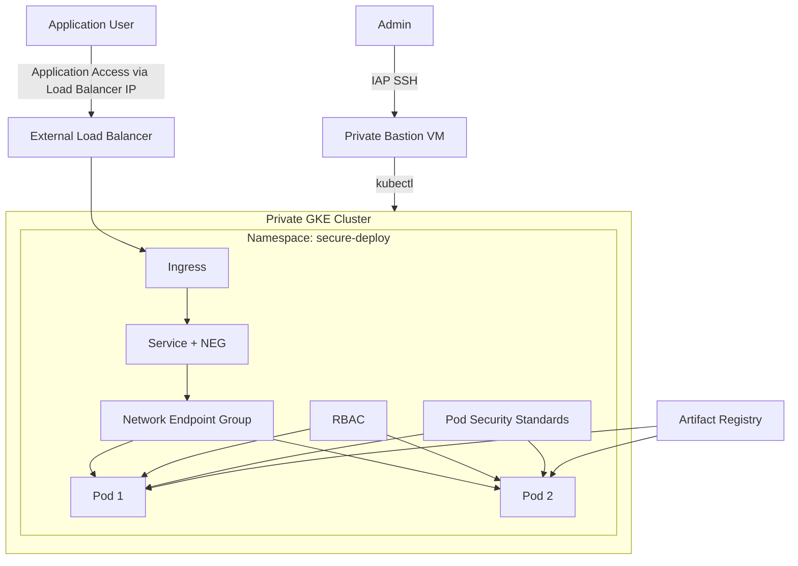

# Secure Private GKE Deployment

## Project Overview

This project demonstrates how to securely deploy and manage applications on a private Google Kubernetes Engine cluster using RBAC, Pod Security Standards, private networking, bastion-based access, Ingress, and NEG-based load balancing. 

---

## Table of Contents
- [Architecture Diagram](https://github.com/SreyasiB/Kubernetes/#architecture-diagram)
- [Features](https://github.com/SreyasiB/Kubernetes/#features)
- [Prereqisites](https://github.com/SreyasiB/Kubernetes/#prerequisites)
- [Step 1 — Create Custom VPC and Private Subnet](https://github.com/SreyasiB/Kubernetes/#step-1--create-custom-vpc-and-private-subnet)
- [Step 2 — Create Bastion VM to access the Private cluster](https://github.com/SreyasiB/Kubernetes/#step-2--create-bastion-vm-to-access-the-private-cluster)
- [Step 3 — Create Node Service Account](https://github.com/SreyasiB/Kubernetes/#step-3--create-node-service-account)
- [Step 4 — Create Private GKE Cluster and access it from cloud shell using bastion](https://github.com/SreyasiB/Kubernetes/#step-4--create-private-gke-cluster-and-access-it-from-cloud-shell)
- [Step 5 — Create Namespace](https://github.com/SreyasiB/Kubernetes/#step-5--create-namespace)
- [Step 6 — Create Kubernetes Service Account](https://github.com/SreyasiB/Kubernetes/#step-6--create-kubernetes-service-account)
- [Step 7 — Configure RBAC](https://github.com/SreyasiB/Kubernetes/#step-7--configure-rbac)
- [Step 8 — Create Deployment](https://github.com/SreyasiB/Kubernetes/#step-8--create-deployment)
- [Step 9 — Create NEG-enabled Service](https://github.com/SreyasiB/Kubernetes/#step-9--create-neg-enabled-service)
- [Step 10 — Create Ingress with static IP](https://github.com/SreyasiB/Kubernetes/#step-10--create-ingress-with-static-ip)
- [Step 11 — Access the application](https://github.com/SreyasiB/Kubernetes/#step-11--access-the-application)
- [Step 12 — Test RBAC](https://github.com/SreyasiB/Kubernetes/#step-12--test-rbac)
- [Cleanup Steps](https://github.com/SreyasiB/Kubernetes/#cleanup-steps)
- [Common Troubleshooting Steps](https://github.com/SreyasiB/Kubernetes/#common-troubleshooting-steps)


## Architecture Diagram




---

## Features

- Private GKE Cluster
- Private Control Plane Endpoint
- Private Nodes
- Bastion VM without Public IP
- IAP Tunnel-based Secure Access
- Kubernetes RBAC
- Pod Security Standards
- NEG-enabled Service
- Kubernetes Ingress
- Secure Container Configuration
- Artifact Registry Integration

---

## Prerequisites
- GCP account with free credits
- Billing enabled
- Cloud Shell Autheticated
- Enabled APIs:
  - Kubernetes Engine API
  - Artifact Registry API
  - Compute Engine API

---

## Step 1 — Create Custom VPC and Private Subnet

Using a custom VPC gives better isolation and control compared to the default VPC.
```bash

# Create VPC
gcloud compute networks create gke-vpc \
  --subnet-mode=custom

# Create Subnet
gcloud compute networks subnets create gke-subnet \
  --network gke-vpc \
  --region asia-south1 \
  --range 10.0.1.0/24 \
  --secondary-range pods=10.4.0.0/14,services=10.8.0.0/20
  --enable-private-ip-google-access
```

---

## Step 2 — Create Bastion VM to access the Private cluster

Since the cluster control plane is private, we need a VM inside the VPC to manage the cluster securely.

```bash
# Create Bastion
gcloud compute instances create gke-bastion \
  --zone asia-south1-a \
  --machine-type e2-micro \
  --network gke-vpc \
  --subnet gke-subnet \
  --no-address \
  --tags iap-ssh \
  --scopes cloud-platform

# Create Firewall Rule to allow IAP SSH Access
# The bastion VM has NO public IP, so IAP is used for secure SSH access.
gcloud compute instances create gke-bastion \
  --zone asia-south1-a \
  --machine-type e2-micro \
  --network gke-vpc \
  --subnet gke-subnet \
  --no-address \
  --tags iap-ssh \
  --scopes cloud-platform

# SSH Into Bastion
gcloud compute ssh gke-bastion \
  --zone asia-south1-a \
  --tunnel-through-iap

# Install required tools
sudo apt update
sudo apt install -y kubectl google-cloud-cli-gke-gcloud-auth-plugin
```

## Step 3 — Create Node Service Account

For least priviledge access, we'll use custom SA instead of default SA. This Service Account is used by GKE worker nodes to pull images, write logs, publish metrics.

```bash

# Create Service Account
gcloud iam service-accounts create gke-node-sa \
  --display-name="GKE Node Service Account"

# Grant IAM Roles to Node SA

PROJECT_ID=$(gcloud config get-value project)

for role in \
roles/artifactregistry.reader \
roles/logging.logWriter \
roles/monitoring.metricWriter \
roles/monitoring.viewer
do
  gcloud projects add-iam-policy-binding $PROJECT_ID \
    --member="serviceAccount:gke-node-sa@$PROJECT_ID.iam.gserviceaccount.com" \
    --role="$role"
done
```

---

## Step 4 — Create Private GKE Cluster and access it from cloud shell using bastion
Ensure that VM's serice accout has **roles/container.clusterViewer** and **roles/container.developer** to get the creds and cluster info.

```bash
# Create Cluster
gcloud container clusters create private-gke-cluster \
  --zone=asia-south1-a \
  --num-nodes=1 \
  --machine-type=e2-medium \
  --service-account=gke-node-sa@$PROJECT_ID.iam.gserviceaccount.com \
  --network=gke-vpc \
  --subnetwork=gke-subnet \
  --cluster-secondary-range-name=pods \
  --services-secondary-range-name=services \
  --enable-ip-alias \
  --enable-private-nodes \
  --enable-private-endpoint \
  --master-ipv4-cidr=172.16.0.0/28 \
  --enable-master-authorized-networks \
  --master-authorized-networks=<Bastion private IP>/32 \
  --scopes=cloud-platform

# Create a Proxy tunnel through bastion 
gcloud compute ssh gke-bastion \
    --zone=asia-south1-a \
    -- -4 -N -p 22 -D localhost:8888

# Open another terminal and set the env variable
export HTTPS_PROXY=socks5h://localhost:8888

# Get the cluster creds
gcloud container clusters get-credentials private-gke-cluster \
  --zone asia-south1-a
  --internal-ip
 
# Verify 
kubectl get nodes

```
---

## Step 5 — Create Namespace

Namespaces isolate workloads logically. Pod Security Standards are enforced at namespace level by adding labels.

```yaml
#namespace.yaml
apiVersion: v1
kind: Namespace
metadata:
  name: secure-deploy
  labels:
    pod-security.kubernetes.io/enforce: restricted
    pod-security.kubernetes.io/enforce-version: latest
```

Apply:

```bash
kubectl apply -f namespace.yaml
```

---

## Step 6 — Create Kubernetes Service Account

we'll use a dedicated kubernetes SA to control what the pods can access in the Kubernetes API.
```bash
kubectl create serviceaccount app-ksa --namespace secure-deploy
```

---

## Step 7 — Configure RBAC

Namespace-scoped RBAC using a dedicated Kubernetes Service Account with read-only permissions for pods, logs, and events. This follows the principle of least privilege by allowing troubleshooting access without permitting destructive operations like deleting pods or modifying workloads.

```yaml
#rbac.yaml
apiVersion: rbac.authorization.k8s.io/v1
kind: Role
metadata:
  namespace: secure-deploy
  name: hello-app-reader
rules:
- apiGroups: [""]
  resources: ["configmaps"]
  verbs: ["get", "list"]

- apiGroups: [""]
  resources:
  - pods
  - pods/log
  - events
  verbs:
  - get
  - list

- apiGroups: ["apps"]
  resources:
  - deployments
  - replicasets
  verbs:
  - get
  - list
---
apiVersion: rbac.authorization.k8s.io/v1
kind: RoleBinding
metadata:
  name: hello-app-reader-binding
  namespace: secure-deploy
subjects:
- kind: ServiceAccount
  name: app-ksa
  namespace: secure-deploy
roleRef:
  kind: Role
  name: hello-app-reader
  apiGroup: rbac.authorization.k8s.io
```

Apply:

```bash
kubectl apply -f rbac.yaml
```

---

## Step 8 — Create Deployment

This deploys the application securely with enforced Security Context: 
- non-root containers
- no privilege escalation
- dropped Linux capabilities
```yaml
#deployment.yaml
apiVersion: apps/v1
kind: Deployment
metadata:
  name: hello-app-deploy
  namespace: secure-deploy
spec:
  replicas: 2
  selector:
    matchLabels:
      app: hello-app
  template:
    metadata:
      labels:
        app: hello-app
    spec:
      serviceAccountName: app-ksa
      
      # Pod-level security: Prevents any container in the pod from running as root
      securityContext:
        runAsNonRoot: true
        runAsUser: 1000
        runAsGroup: 1000
        seccompProfile:
          type: RuntimeDefault

      containers:
      - name: hello-app
        image: asia-south1-docker.pkg.dev/$PROJECT_ID/hello-app-repo/hello-app:v1
        ports:
        - containerPort: 8080
        
        # Container-level security: Locks down the specific process
        securityContext:
          allowPrivilegeEscalation: false
          readOnlyRootFilesystem: true
          capabilities:
            drop: ["ALL"]

        resources:
          requests:
            cpu: "50m"
            memory: "64Mi"
          limits:
            cpu: "200m"
            memory: "128Mi"
```

Apply:

```bash
kubectl apply -f deployment.yaml
```

---

## Step 9 — Create NEG-enabled Service

NEG enables container-native load balancing. Traffic goes directly from Load Balancer → Pod IP instead of Load Balancer → NodePort → Pod

```yaml
#service.yaml
apiVersion: v1
kind: Service
metadata:
  name: hello-app-service
  namespace: secure-deploy
  annotations:
    cloud.google.com/neg: '{"ingress": true}'
spec:
  selector:
    app: hello-app
  ports:
  - port: 80
    targetPort: 8080
  type: ClusterIP
```

Apply:

```bash
kubectl apply -f service.yaml
```

---

## Step 10 — Create Ingress with static IP

Ingress automatically provisions:
- External HTTP Load Balancer
- backend services
- health checks
- forwarding rules

```bash
# Reserve a static IP first
gcloud compute addresses create my-static-ip \
  --global
```
```yaml
#ingress.yaml
apiVersion: networking.k8s.io/v1
kind: Ingress
metadata:
  name: hello-app-ingress
  namespace: secure-deploy
  annotations:
    kubernetes.io/ingress.class: "gce"
    kubernetes.io/ingress.global-static-ip-name: "my-static-ip"
spec:
  rules:
  - http:
      paths:
      - path: /
        pathType: Prefix
        backend:
          service:
            name: hello-app-service
            port:
              number: 80
```

Apply:

```bash
kubectl apply -f ingress.yaml
```

---

## Step 11 — Access the application
```bash
# Get the reserved external IP
gcloud compute addresses describe my-static-ip --global \
  --format="get(address)"
```
#### Open a browser and enter the IP like below
```bash
35.193.59.88
```

#### Expected Output
```bash
Hello! This app is running on GKE private cluster.
```
---

# Step 12 — Test RBAC

```bash
# Allowed Permission
kubectl auth can-i get pods \
--as system:serviceaccount:secure-deploy:app-ksa \
-n secure-deploy
```

Expected:

```text
yes
```

---

```bash
# Denied Permission
kubectl auth can-i delete pods \
--as system:serviceaccount:secure-deploy:app-ksa \
-n secure-deploy
```

Expected:

```text
no
```

---

## Cleanup Steps
```bash
# Delete static IP
gcloud compute addresses delete my-static-ip --global

# Delete Ingress
kubectl delete ingress hello-app-ingress -n secure-deploy

# Delete Service
kubectl delete svc hello-app-service -n secure-deploy

#Delete Deployment
kubectl delete deployment hello-app-deploy -n secure-deploy

# Delete Namespace
kubectl delete ns secure-deploy

# Delete Cluster
gcloud container clusters delete private-gke-cluster \
  --zone asia-south1-a

# Delete Bastion VM
gcloud compute instances delete gke-bastion \
  --zone asia-south1-a

# Delete Firewall Rule
gcloud compute firewall-rules delete allow-iap-ssh

# Delete Subnet
gcloud compute networks subnets delete gke-subnet \
  --region asia-south1

# Delete VPC
gcloud compute networks delete gke-vpc
```

---

## Common Troubleshooting Steps

| Problem | Possible Cause | Fix |
|---|---|---|
| Unable to connect to cluster using kubectl | Running outside VPC | SSH into bastion VM through IAP and then connect to cluster |
| Pods stuck in `ImagePullBackOff` | Node Service Account missing Artifact Registry permissions | Grant: roles/artifactregistry.reader |
| Bastion VM SSH not working | Missing IAP firewall rule | Create firewall rule : [Refer to Step 2](https://github.com/SreyasiB/Kubernetes/edit/main/README.md#step-2--create-bastion-vm-to-access-the-private-cluster) |
| kubectl commands return Forbidden | RBAC restriction | Verify permissions: [Refer to Step 12](https://github.com/SreyasiB/Kubernetes/edit/main/README.md#step-12--test-rbac) |

